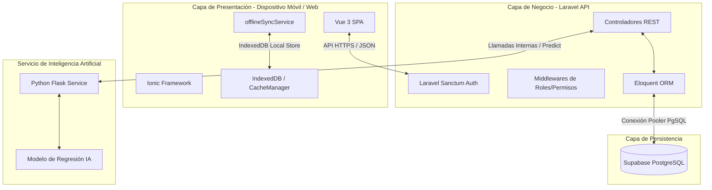
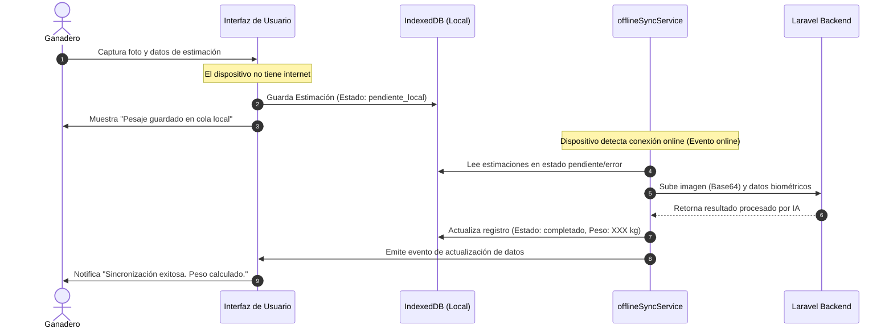

# BOVWEIGHT CR - DOCUMENTACIÓN CONSOLIDADA MAESTRA
## Manual Técnico, Manual de Usuario, Plan de Pruebas, Auditoría Funcional y Roadmap

Este documento centraliza toda la información técnica, de diseño, de experiencia de usuario y de aseguramiento de la calidad de la plataforma **BovWeight CR** según su estado de implementación real.

---

## 1. Información General del Proyecto

### Nombre del Sistema
**BovWeight CR** (Bovino Weight Costa Rica)

### Objetivo General
Digitalizar y modernizar la gestión ganadera en Costa Rica a través de herramientas de estimación de peso bovino por Inteligencia Artificial, control de rebaños, reportes clínicos y soporte completo sin conexión a internet.

### Alcance
La plataforma abarca:
1. Aplicación móvil híbrida para el ganadero y el veterinario (con soporte offline en IndexedDB).
2. Panel de administración web (Laravel Blade) para la gestión global y auditorías de datos.
3. API RESTful en Laravel que procesa la lógica de negocio y seguridad.
4. Microservicio de IA en Python para la predicción de peso mediante modelos regresivos entrenados con rasgos biométricos y análisis de imágenes.

### Problema que Resuelve
* **Costos elevados**: Evita la compra e instalación de básculas físicas costosas en corrales remotos.
* **Falta de cobertura celular**: Resuelve la inoperabilidad de sistemas cloud en zonas rurales de Costa Rica mediante un sistema local de persistencia e inicio de sesión offline.
* **Salud del hato**: Automatiza alertas de pérdida drástica de peso (mayor al 10%) para visitas médicas veterinarias oportunas.

### Tecnologías Utilizadas
* **Frontend**: Vue 3 (Composition API), Ionic Framework v7 (Componentes adaptativos), TypeScript, IndexedDB (Almacenamiento Local), Chart.js (Graficación).
* **Backend**: Laravel 11, Eloquent ORM, Laravel Sanctum (Autenticación), SMTP Mail (Notificaciones).
* **Servicio IA**: Python 3.10, Flask, Scikit-Learn (Modelos de regresión), Pandas, NumPy.
* **Base de Datos**: PostgreSQL 15 (Supabase Cloud).

---

## 2. Arquitectura del Sistema

El sistema utiliza una arquitectura de tres capas optimizada para entornos con conectividad inestable.



### Mecanismo de Sincronización y Caché
* **CacheManager**: Encapsula las lecturas locales usando `IndexedDB`. Las claves se estructuran con un alcance por usuario (`user_${userId}_${key}`) para evitar fugas de información al cambiar de sesión en el mismo terminal.
* **offlineSyncService**: Detecta el estado de red a nivel de navegador. Encola las estimaciones fallidas y las procesa de manera ordenada al restablecerse la conexión.

---

## 3. Modelo de Base de Datos

Esquema de relaciones relacionales de la persistencia de BovWeight CR:

```mermaid
erDiagram
    ROLES ||--o{ USUARIOS : "tiene"
    USUARIOS ||--o{ FINCAS : "es propietario de"
    USUARIOS ||--o{ RECORDATORIOS_SANITARIOS : "crea"
    USUARIOS ||--o{ CITAS : "organiza"
    FINCAS ||--o{ ANIMALES : "contiene"
    RAZAS ||--o{ ANIMALES : "clasifica"
    ANIMALES ||--o{ ESTIMACIONES_PESO : "tiene registros de"
    USUARIOS ||--o{ FINCA_VETERINARIO : "asigna veterinario"
    FINCAS ||--o{ FINCA_VETERINARIO : "recibe veterinario"
    USUARIOS ||--o{ REPORTES_VETERINARIOS : "redacta"
    ANIMALES ||--o{ REPORTES_VETERINARIOS : "es objeto de"

    USUARIOS {
        int id PK
        string correo UNIQUE
        string contrasena_hash
        string nombre_completo
        int rol_id FK
        boolean activo
        boolean debe_cambiar_password
        timestamp password_expira_en
    }

    ROLES {
        int id PK
        string nombre
    }

    FINCAS {
        int id PK
        string nombre
        string ubicacion
        int propietario_id FK
    }

    RAZAS {
        int id PK
        string nombre
        string descripcion
    }

    ANIMALES {
        int id PK
        string nombre
        string numero_arete UNIQUE
        date fecha_nacimiento
        string sexo
        string color
        string estado
        int finca_id FK
        int raza_id FK
        text observaciones
    }

    ESTIMACIONES_PESO {
        int id PK
        int animal_id FK
        float peso_estimado_kg
        float peso_corregido_kg
        string ruta_imagen
        timestamp created_at
    }

    FINCA_VETERINARIO {
        int finca_id PK, FK
        int veterinario_id PK, FK
        boolean activo
        json animales_autorizados
    }

    RECORDATORIOS_SANITARIOS {
        int id PK
        int usuario_id FK
        int finca_id FK
        int animal_id FK
        string titulo
        text descripcion
        string tipo
        date fecha_programada
        string estado
        boolean notificado
    }

    CITAS {
        int id PK
        int ganadero_id FK
        int veterinario_id FK
        int finca_id FK
        timestamp fecha_hora
        string motivo
        string estado
    }

    REPORTES_VETERINARIOS {
        int id PK
        int veterinario_id FK
        int ganadero_id FK
        int finca_id FK
        int animal_id FK
        text diagnostico
        text tratamiento
        string estado
    }
    
    AUDITORIAS {
        int id PK
        int usuario_id FK
        string accion
        string tabla
        int registro_id
        json valores_anteriores
        json valores_nuevos
        string direccion_ip
        timestamp created_at
    }
```

---

## 4. Funcionalidades por Rol

### Login y Gestión de Acceso
* **Inicio de sesión en línea [Implementado]**: Autenticación segura mediante API Laravel Sanctum que retorna token JWT.
* **Cambio obligatorio de contraseña [Implementado]**: Flujo que fuerza a cambiar contraseñas autogeneradas de un solo uso antes de entrar a la aplicación.
* **Persistencia de sesión [Implementado]**: Mantenimiento seguro en `localStorage` con interceptores que limpian datos si el token expira (Error 401).
* **Login Offline [Implementado]**: Fallback a credenciales locales hasheadas en `localStorage` (`cached_credentials_list`), lo que permite el acceso en campo profundo.

---

### Módulo del Administrador
* **Dashboard Web [Implementado]**: Resumen estadístico de usuarios activos, fincas registradas y recuento global del hato.
* **Gestión de Usuarios [Implementado]**: Registro, edición y eliminación lógica de administradores, ganaderos y veterinarios.
* **Activar/Desactivar Cuentas [Implementado]**: Control de suspensión temporal de cuentas desde el panel de control.
* **Bitácora de Auditoría [Implementado]**: Registro obligatorio en base de datos de cada acción (insertar, actualizar, borrar), guardando valores antiguos, valores nuevos, usuario e IP de origen.

---

### Módulo del Ganadero
* **Dashboard del Hato [Implementado]**: Tarjetas con datos clave como cantidad de reses, peso promedio general y gráfico lineal de tendencia temporal.
* **Gestión de Fincas [Implementado]**: CRUD completo para registrar los terrenos donde pasta el ganado.
* **Gestión de Animales [Implementado]**: Expediente del bovino con arete único, peso actual, gráfico de evolución y observaciones clínicas.
* **Estimación por IA [Implementado]**: Envío de imágenes al servidor de Python y estimación a través de las medidas de perímetro torácico y longitud corporal.
* **Asignación de Permisos [Implementado]**: Elección de qué veterinario tiene acceso a qué fincas o animales específicos de su hato.
* **Agenda y Citas [Implementado]**: Solicitud de citas clínicas que quedan en espera de confirmación del veterinario.

---

### Módulo del Veterinario
* **Visualización de Fincas Autorizadas [Implementado]**: Menú con las fincas exclusivas asignadas por el ganadero.
* **Ficha Médica de Animales [Implementado]**: Inspección de la salud del rebaño y del historial de pesaje.
* **Creación de Reportes Clínicos [Implementado]**: Elaboración de diagnósticos, tratamientos farmacológicos y cambio del estado del bovino (Sano, Enfermo, En Tratamiento).
* **Gestión de Citas [Implementado]**: Aceptación o rechazo de solicitudes de citas agendadas por los ganaderos.
* **Alertas Rojas de Peso [Implementado]**: Detección dinámica y prioritaria de reses con una pérdida de peso corporal superior al 10% en un plazo menor a 30 días.

---

## 5. Sistema Offline y Sincronización

El soporte offline es crucial para operaciones en campo (donde la cobertura celular suele ser deficiente). BovWeight CR implementa un flujo robusto de almacenamiento local y sincronización diferida.



### Componentes de Sincronización
1. **Detección de Conexión**: Suscripción nativa a los eventos `window.addEventListener('online')` y `offline`.
2. **Cola en IndexedDB**: Almacenamiento local del formulario de estimación e imágenes en formato Base64.
3. **Reprocesamiento en Lotes**: Al activarse la red, se envían las peticiones ordenadamente a la API Laravel para que consuma el microservicio de IA en Python y devuelva el peso definitivo, actualizando IndexedDB y sincronizando el estado con el servidor principal.

---

## 6. Seguridad y Control de Acceso

1. **Tokens de Acceso (Sanctum)**: Flujo controlado por tokens Bearer validados mediante la tabla nativa `personal_access_tokens`.
2. **Middleware AttachAuthenticatedUserHeaders**: Middleware que extrae el ID y rol de usuario del token validado por Sanctum y los reescribe de forma forzada en los headers de solicitud interna `X-User-Id` y `X-User-Role`. Esto evita la manipulación maliciosa de cabeceras desde Postman o Consola de Desarrollador.
3. **Control de Roles (RBAC)**: Bloqueo de rutas en la API mediante el middleware `EnsureRole` (e.g. `Route::middleware('role:admin')`).
4. **Permisos de Consulta**: 
   * Los ganaderos solo pueden ver registros asociados a su ID de propietario.
   * Los veterinarios solo consultan fincas y bovinos autorizados previamente en la tabla asociativa `finca_veterinario`.

---

## 7. Catálogo de Endpoints de la API

| Método | Endpoint | Middleware | Rol Autorizado | Descripción |
| :--- | :--- | :--- | :--- | :--- |
| **POST** | `/api/login` | Público | Cualquiera | Autentica al usuario y entrega el Token Sanctum |
| **POST** | `/api/recuperar-password` | Público | Cualquiera | Genera y envía contraseña temporal por e-mail |
| **POST** | `/api/logout` | `auth:sanctum` | Cualquiera | Revoca y elimina el token de la sesión activa |
| **POST** | `/api/cambiar-password` | `auth:sanctum` | Cualquiera | Cambia la contraseña temporal por una definitiva |
| **GET** | `/api/animales` | `auth:sanctum` | Ganadero, Veterinario | Obtiene los bovinos según propiedad o asignación |
| **GET** | `/api/animales/{id}` | `auth:sanctum` | Ganadero, Veterinario | Obtiene la ficha completa e historial del animal |
| **POST** | `/api/animales` | `auth:sanctum` | Ganadero | Registra un nuevo bovino en una finca |
| **PUT** | `/api/animales/{id}` | `auth:sanctum` | Ganadero | Edita los datos generales de un bovino |
| **DELETE**| `/api/animales/{id}` | `auth:sanctum` | Ganadero | Elimina un animal del hato |
| **POST** | `/api/estimar-peso` | `auth:sanctum` | Ganadero | Invoca el microservicio de IA y estima el peso |
| **GET** | `/api/fincas` | `auth:sanctum` | Ganadero, Veterinario | Obtiene la lista de fincas autorizadas o propias |
| **POST** | `/api/fincas` | `auth:sanctum` | Ganadero | Crea una finca nueva |
| **PUT** | `/api/fincas/{id}` | `auth:sanctum` | Ganadero | Actualiza información de una finca |
| **GET** | `/api/usuarios` | `auth:sanctum`, `role:admin`| Admin | Obtiene el listado completo de usuarios |
| **POST** | `/api/usuarios` | `auth:sanctum`, `role:admin`| Admin | Registra un nuevo usuario en el sistema |
| **PUT** | `/api/usuarios/{id}` | `auth:sanctum` | Admin, Ganadero | Permite actualizar el perfil propio o de un usuario |

---

## 8. Auditoría Funcional y Bitácora de Correcciones

### Funcionalidades que Operan al 100%
* **Sincronización Offline**: Flujo de IndexedDB y recarga de colas pendientes cuando el dispositivo móvil detecta conexión.
* **Control de Roles en Backend**: Autenticación estricta con cabeceras blindadas en Laravel.
* **Envío de Correos Automatizados**: Envío de avisos de bienvenida, credenciales temporales y reportes de confirmación.
* **Aislamiento de Sesiones**: Scoping estricto de la caché por ID de usuario para evitar que se mezclen datos entre cuentas en un mismo dispositivo móvil.

### Bugs Críticos Corregidos
1. **Conflicto de Rutas Duplicadas**: Se eliminó una ruta duplicada `PUT /usuarios/{id}` en `api.php` que provocaba denegación de permisos para los ganaderos al actualizar sus perfiles.
2. **Incompatibilidad SQL en Supabase**: Se ajustaron las comparaciones de tipos booleanos con enteros (e.g. `1` o `0`) en Eloquent, reemplazándolas por booleanos nativos (`true`/`false`) o directivas `whereRaw` compatibles con PostgreSQL.
3. **Cierre de Sesión Incompleto**: Se modificaron las funciones de logout del cliente para forzar la eliminación de tokens JWT residuales.

### Riesgos Detectados y Mitigados
* **Riesgo**: Dispositivos compartidos que muestran datos residuales de sesiones previas en IndexedDB al no contar con internet.
* **Mitigación**: Se implementó una clave scoped con el ID del usuario (`user_${userId}_${key}`) de manera que un usuario no pueda leer las copias de caché local de otro.

---

## 9. Plan de Pruebas Ejecutado

La suite de pruebas automatizadas se corre en el backend mediante PHPUnit.

### Casos de Pruebas Ejecutados

#### 1. Validación de Correo Único (`UserProfilePhotoTest`)
* **Objetivo**: Evitar registros con correos duplicados.
* **Resultado**: **Exitoso**. Validador retorna 422.

#### 2. Expiración de Claves Temporales (`PasswordRecoveryTest`)
* **Objetivo**: Impedir accesos con claves temporales vencidas tras 24 horas.
* **Resultado**: **Exitoso**. Respuesta del servidor 403.

#### 3. Control de Acceso por Roles (`EnsureRole` Middleware)
* **Objetivo**: Bloquear el acceso de Veterinarios o Ganaderos a la administración.
* **Resultado**: **Exitoso**. Retorna 403 Forbidden.

#### 4. Estimación del Peso por IA (`AnimalEstimationTest`)
* **Objetivo**: Confirmar el envío de medidas al microservicio Python y respuesta correcta.
* **Resultado**: **Exitoso**. Registra pesaje en base de datos.

### Resultados de la Suite Automatizada
```bash
php artisan test
```
```
PASS  Tests\Feature\ExampleTest
✓ test the application returns a successful response (302 redirect to admin login)

PASS  Tests\Feature\PasswordRecoveryTest
✓ request password recovery success
✓ request password recovery fails with invalid or non existent email
✓ change password success
✓ change password fails if incorrect current password

PASS  Tests\Feature\UserProfilePhotoTest
✓ can upload profile photo as file
✓ can upload profile photo as base64

Tests:    8 passed (34 assertions)
Duration: 1.07s
```

---

## 10. Manual de Usuario paso a paso

### A. Para el Administrador

#### 1. Gestión de Usuarios
1. Ingrese a **Admin Panel** > **Usuarios**.
2. Presione **Nuevo Usuario**.
3. Complete el correo, nombre completo y el rol asignado (Ganadero o Veterinario).
4. El sistema guardará el registro, creará una contraseña temporal e iniciará el envío automático de credenciales al correo del usuario.
5. Para bloquear temporalmente un usuario, presione el interruptor **Activo/Inactivo** junto al nombre.

#### 2. Auditoría
1. Ingrese a **Bitácora** en la barra lateral.
2. Filtre por fecha o por usuario.
3. El panel mostrará un histórico de qué registro fue modificado, qué valores tenía antes y qué valores tiene ahora, junto a la dirección IP de origen de la transacción.

---

### B. Para el Ganadero

#### 1. Primer Ingreso y Contraseñas
1. Al ser creado su usuario, revise su bandeja de entrada (e-mail) y copie su contraseña temporal.
2. Inicie sesión en BovWeight CR con su e-mail y clave temporal.
3. El sistema le solicitará definir una nueva contraseña definitiva. Ingrese la actual y defina la nueva (mínimo 6 caracteres).
4. Al confirmar, el sistema le enviará un correo de seguridad y le llevará a su panel principal.

#### 2. Agregar Fincas y Bovinos
1. Diríjase a **Mis Fincas** y presione **Crear Finca**. Indique el nombre y la ubicación de su finca.
2. Vaya a **Mi Rebaño** y presione el botón de agregar animal (+).
3. Complete el arete identificador único, nombre, finca a la que pertenece, raza y fecha de nacimiento.
4. Presione **Guardar**.

#### 3. Estimar Peso por IA
* **Por Medidas**: Ingrese a **Estimar Peso** > **Medidas Corporales**. Mida con una cinta de pesaje el perímetro torácico (cm) y la longitud (cm). Complete los campos y presione **Calcular**.
* **Por Fotografía**: Ingrese a **Estimar Peso** > **Fotografía**. Suba una foto de lado completo del animal. La res debe estar de pie, sola, en terreno plano y con buena iluminación. Presione **Estimar Peso**.

---

### C. Para el Veterinario

#### 1. Revisar Animales Asignados
1. Al iniciar sesión, accederá a su panel prioritario.
2. Verá una sección de **Alertas Rojas** destacando aquellos animales de sus fincas asignadas que han tenido una pérdida de peso drástica superior al 10% en el último mes.
3. Diríjase a **Mis Fincas** para seleccionar la finca del ganadero que le contrató. Se desplegará la lista de bovinos para los que posee autorización de consulta médica.

#### 2. Crear Reporte Clínico
1. Ingrese al expediente del animal enfermo.
2. Presione **Crear Reporte Clínico**.
3. Redacte el diagnóstico físico del animal, los medicamentos recetados y el tratamiento a seguir.
4. Establezca el estado médico del animal (Abierto, En Seguimiento, Resuelto) y presione **Guardar**. El propietario del animal podrá visualizar el informe médico al instante.

---

## 11. Roadmap de Mejoras

Basado en el análisis real del código fuente y del repositorio:

### Alta Prioridad
* **Omitir revalidación de caché en background si hay un error 401**: Detener llamadas de revalidación silenciosa en background de `CacheManager` cuando el servidor retorne `401 Unauthorized` (Token expirado), evitando saturación de llamadas del interceptor de autenticación.
* **Carga progresiva de imágenes Base64 en modo Offline**: Comprimir de forma más agresiva las fotos tomadas en el corral antes de insertarlas en IndexedDB para evitar el agotamiento rápido del almacenamiento del dispositivo móvil.

### Media Prioridad
* **Buscador global indexado en IndexedDB**: Implementar búsquedas rápidas locales por número de arete o nombre en el frontend cuando se trabaje sin conexión a internet.
* **Recordatorios Sanitarios locales con notificaciones push**: Configurar recordatorios de desparasitaciones y vacunas locales que despierten notificaciones del celular utilizando servicios locales si no hay internet en el corral.

### Baja Prioridad
* **Descarga de PDF de Reportes Clínicos**: Opción para que el veterinario exporte un archivo PDF formateado del reporte clínico de un bovino directamente a los archivos locales del celular del ganadero.
* **Modo Oscuro Integrado**: Tematización visual en base a CSS variables para facilitar la lectura del panel de estimación de peso bajo condiciones de luz solar intensa en el campo.
