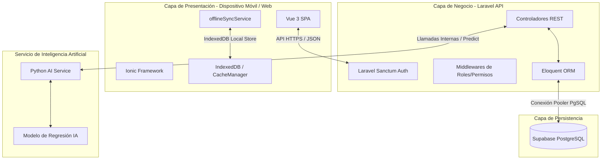
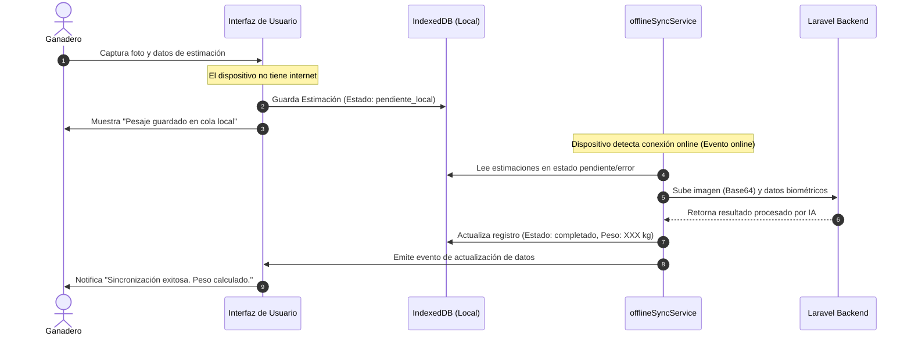

# Documentación Técnica Completa - BovWeight CR

Este documento detalla la arquitectura de software, el diseño del sistema, la base de datos, los patrones de diseño y la configuración técnica general del sistema BovWeight CR.

---

## 1. Arquitectura General del Sistema

BovWeight CR es una plataforma integrada que utiliza una arquitectura de tres capas para ofrecer estimación de peso bovino mediante Inteligencia Artificial, gestión de hatos y reportes clínicos en tiempo real.



### Componentes de la Arquitectura
1. **Frontend (App Móvil / Web)**: Single Page Application (SPA) construida con **Vue 3** e **Ionic Framework**. Proporciona una interfaz táctil híbrida, compatible con Android, iOS y navegadores web. Cuenta con soporte offline mediante IndexedDB.
2. **Backend (API RESTful)**: Desarrollado en **Laravel 11**. Administra la lógica de negocio, control de acceso, auditorías y almacenamiento persistente.
3. **Servicio de IA (ML Engine)**: Un microservicio desarrollado en **Python** que expone un modelo entrenado de Machine Learning para predecir el peso bovino mediante rasgos biométricos o procesamiento de imágenes.
4. **Base de Datos**: PostgreSQL alojado en **Supabase**, utilizando el pooler transaccional para optimizar las conexiones concurrentes del backend.

---

## 2. Pila Tecnológica (Tech Stack)

### Frontend
- **Framework Principal**: Vue 3 (Composition API, `<script setup lang="ts">`).
- **Framework de UI**: Ionic Framework v7 (Componentes adaptativos iOS/Android).
- **Enrutador**: Vue Router para la navegación SPA.
- **Cliente HTTP**: Axios con interceptores personalizados para manejo automatizado de tokens.
- **Gráficos**: Chart.js y Vue-Chartjs para tendencias de peso.
- **Base de Datos Local**: IndexedDB gestionada con un `CacheManager` para soporte offline.

### Backend
- **Framework**: Laravel 11.x.
- **Lenguaje**: PHP 8.2+.
- **Autenticación**: Laravel Sanctum (Tokens Bearer basados en base de datos).
- **Mapeador Relacional**: Eloquent ORM.
- **Base de Datos**: PostgreSQL 15 (Supabase).

### Servicio de IA
- **Framework**: Python 3.10+ con Flask.
- **Librerías Científicas**: Scikit-Learn, Pandas, NumPy, OpenCV (para preprocesamiento de imágenes).

---

## 3. Modelo de Datos (Esquema de Base de Datos)

El sistema utiliza una base de datos relacional PostgreSQL. A continuación se presentan las tablas principales y sus relaciones:

```mermaid
erDiagram
    ROLES ||--o{ USUARIOS : "tiene"
    USUARIOS ||--o{ FINCAS : "es propietario de"
    USUARIOS ||--o{ RECORDATORIOS_SANITARIOS : "crea"
    USUARIOS ||--o{ CITAS : "organiza"
    FINCAS ||--o{ ANIMALES : "contiene"
    RAZAS ||--o{ ANIMALES : "clasifica"
    ANIMALES ||--o{ ESTIMACIONES_PESO : "tiene registros de"
    USUARIOS ||--o{ FINCA_VETERINARIO : "asigna veterinario"
    FINCAS ||--o{ FINCA_VETERINARIO : "recibe veterinario"
    USUARIOS ||--o{ REPORTES_VETERINARIOS : "redacta"
    ANIMALES ||--o{ REPORTES_VETERINARIOS : "es objeto de"

    USUARIOS {
        int id PK
        string correo UNIQUE
        string contrasena_hash
        string nombre_completo
        int rol_id FK
        boolean activo
        boolean debe_cambiar_password
        timestamp password_expira_en
        int ganadero_id FK
    }

    ROLES {
        int id PK
        string nombre
    }

    FINCAS {
        int id PK
        string nombre
        string ubicacion
        int propietario_id FK
    }

    RAZAS {
        int id PK
        string nombre
        string descripcion
    }

    ANIMALES {
        int id PK
        string nombre
        string numero_arete UNIQUE
        date fecha_nacimiento
        string sexo
        string color
        string estado
        int finca_id FK
        int raza_id FK
        text observaciones
    }

    ESTIMACIONES_PESO {
        int id PK
        int animal_id FK
        float peso_estimado_kg
        float peso_corregido_kg
        string ruta_imagen
        timestamp created_at
    }

    FINCA_VETERINARIO {
        int finca_id PK, FK
        int veterinario_id PK, FK
        boolean activo
        json animales_autorizados
    }

    RECORDATORIOS_SANITARIOS {
        int id PK
        int usuario_id FK
        int finca_id FK
        int animal_id FK
        string titulo
        text descripcion
        string tipo
        date fecha_programada
        string estado
        boolean notificado
    }

    CITAS {
        int id PK
        int ganadero_id FK
        int veterinario_id FK
        int finca_id FK
        timestamp fecha_hora
        string motivo
        string estado
    }

    REPORTES_VETERINARIOS {
        int id PK
        int veterinario_id FK
        int ganadero_id FK
        int finca_id FK
        int animal_id FK
        text diagnostico
        text tratamiento
        string estado
    }
    
    AUDITORIAS {
        int id PK
        int usuario_id FK
        string accion
        string tabla
        int registro_id
        json valores_anteriores
        json valores_nuevos
        string direccion_ip
        timestamp created_at
    }
```

---

## 4. Patrones de Diseño Aplicados

Para garantizar la mantenibilidad, escalabilidad y desacoplamiento del sistema, se han aplicado los siguientes patrones de diseño de software en la capa de datos y negocio del frontend:

### A. Patrón Repository (Repositorio)
Aísla la capa de persistencia de la interfaz de usuario. Los componentes de Vue consumen interfaces genéricas en lugar de instanciar Axios o realizar peticiones directamente.
- **Interfaces**: `IAnimalRepository`, `IAuthRepository` expuestas en `src/services/interfaces.ts`.
- **Implementación concreta**: `LaravelAnimalRepository` y `LaravelAuthRepository` gestionan la comunicación con Laravel y la caché local.
- **Beneficio**: Si en el futuro se cambia de API REST a GraphQL o Firebase, solo se modifica la implementación del repositorio sin alterar un solo componente de la UI.

### B. Patrón Factory (Fábrica)
Centraliza la lógica de instanciación de los repositorios según la configuración del entorno.
- **Archivo**: `src/services/repository-factory.ts`.
- **Funcionamiento**: Examina variables de entorno para decidir si retorna la versión conectada a Laravel o una versión simulada (Mock) para pruebas de desarrollo ágiles.

### C. Patrón Adapter (Adaptador)
Convierte las respuestas crudas de la API y bases de datos a modelos e interfaces de TypeScript compatibles con el frontend.
- **Funcionamiento**: Laravel envía claves en formato snake_case (e.g. `numero_arete`, `peso_actual`), mientras que el frontend utiliza interfaces estándar en camelCase o campos adaptados (`arete`, `pesoActual`). El repositorio realiza esta transformación al retornar el resultado.

### D. Patrón Strategy (Estrategia)
Se utiliza para calcular y evaluar el estado corporal o tendencia de peso del bovino basándose en el historial.
- **Funcionamiento**: El composable `useWeightStatus` encapsula las diferentes estrategias de comparación de pesos (últimos 30 días vs. históricos) para catalogar al animal (e.g., "Ganancia óptima", "Pérdida Crítica", "Estable").

---

## 5. Arquitectura de Sincronización y Soporte Offline

El soporte offline es crucial para operaciones en campo (donde la cobertura celular suele ser deficiente). BovWeight CR implementa un flujo robusto de almacenamiento local y sincronización diferida.



### Mecanismos Técnicos
- **Detección de Red**: Monitoreo dinámico de eventos de red del navegador (`window.addEventListener('online')` y `offline`).
- **IndexedDB**: Almacena de forma persistente las imágenes en Base64 y los datos biométricos (arete, raza, sexo, edad, perímetro torácico, longitud corporal) estructurados como `OfflineEstimation`.
- **Cola de Sincronización**: `offlineSyncService` procesa de forma secuencial cada elemento de la cola para evitar saturar el canal de comunicación o el servidor de IA.

---

## 6. Seguridad y Control de Acceso

### Autenticación
- **Laravel Sanctum**: Emite tokens de acceso seguros (`PersonalAccessToken`). El frontend almacena el token dentro de la clave `usuario_sesion` en `localStorage`.
- **Interceptor de Axios**: Adjunta automáticamente el encabezado `Authorization: Bearer <token>` en cada solicitud saliente. Limpia las credenciales y expulsa al usuario al recibir una respuesta `401 Unauthorized`.

### Control de Acceso Basado en Roles (RBAC)
- **Middleware `EnsureRole` en Laravel**: Bloquea el acceso a rutas protegidas si el rol del usuario autenticado no coincide con los autorizados (e.g., `Route::middleware(['role:admin'])`).
- **Seguridad en Cabeceras (`AttachAuthenticatedUserHeaders`)**: Para mayor protección frente a alteraciones de cliente, este middleware de Laravel extrae el ID y Rol directamente del token autenticado por Sanctum y sobrescribe los encabezados de solicitud internos `X-User-Id` y `X-User-Role`.

### Permisos por Registro
- **Ganaderos**: Las consultas de base de datos están limitadas a su ID de propietario (`propietario_id = auth_id`).
- **Veterinarios**: Se verifica la existencia de registros activos en la tabla de asignación `finca_veterinario` para autorizar la lectura de animales o fincas específicas.

---

## 7. Catálogo de Endpoints de la API

Todas las rutas requieren el prefijo `/api` y el encabezado `Accept: application/json`.

| Método | Endpoint | Middleware | Descripción |
| :--- | :--- | :--- | :--- |
| **POST** | `/login` | Público | Autentica credenciales y retorna token Sanctum |
| **POST** | `/recuperar-password` | Público | Genera y envía contraseña temporal por correo |
| **GET** | `/me` | `auth:sanctum` | Retorna los detalles del usuario autenticado actual |
| **POST** | `/logout` | `auth:sanctum` | Revoca y elimina el token de sesión actual |
| **POST** | `/cambiar-password` | `auth:sanctum` | Permite actualizar la contraseña de acceso |
| **GET** | `/animales` | `auth:sanctum` | Lista animales filtrados por el rol del usuario |
| **GET** | `/animales/{id}` | `auth:sanctum` | Retorna detalles y expediente de un animal |
| **POST** | `/animales` | `auth:sanctum` | Registra un nuevo bovino en el sistema |
| **POST** | `/estimar-peso` | `auth:sanctum` | Envía parámetros a la IA para estimar el peso |
| **GET** | `/fincas` | `auth:sanctum` | Lista fincas según pertenencia o asignación |
| **POST** | `/citas` | `auth:sanctum` | Crea solicitudes de citas clínico-veterinarias |
| **GET** | `/admin/dashboard` | `role:admin` | Retorna estadísticas generales del sistema |
| **GET** | `/admin/usuarios` | `role:admin` | Lista usuarios registrados con paginación |
| **PATCH**| `/admin/usuarios/{id}/status` | `role:admin` | Activa o desactiva la cuenta de un usuario |

---

## 8. Pipeline de Integración y Despliegue Continuo (CI/CD)

El sistema utiliza un pipeline básico configurado mediante GitHub Actions para garantizar la calidad del código y la automatización de lanzamientos.

### Flujo de Trabajo (Workflow)
1. **Fase de Integración (CI)**:
   - Ejecución de Linters para TypeScript y Vue.
   - Ejecución de pruebas unitarias y de integración en Laravel (`php artisan test`).
2. **Fase de Despliegue (CD)**:
   - Despliegue automático de la API REST a **Railway** tras pasar la rama principal (`main`).
   - Sincronización automática de migraciones de base de datos en Supabase.
   - Compilación del cliente web y distribución estática.
