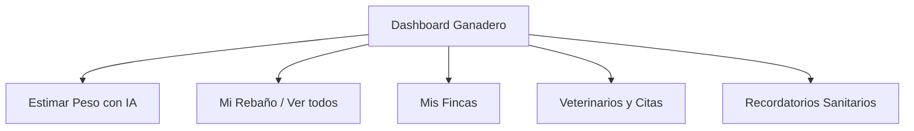

# Manual de Usuario - BovWeight CR

Bienvenido al manual de usuario oficial de **BovWeight CR**. Este documento le guiará paso a paso para comprender y dominar todas las funcionalidades de la aplicación, ya sea como Administrador, Ganadero o Veterinario.

---

## 1. Introducción a BovWeight CR

**BovWeight CR** es una solución digital integral diseñada para modernizar la ganadería en Costa Rica. El sistema le permite:
- **Estimar el peso corporal de bovinos** mediante Inteligencia Artificial usando una foto de cámara o ingresando medidas biométricas básicas.
- **Llevar un historial digital de pesajes** de su hato ganadero sin depender de básculas físicas costosas.
- **Trabajar sin conexión a internet (Offline)** en corrales o zonas de montaña profunda y sincronizar los datos automáticamente cuando vuelva a tener cobertura.
- **Facilitar la colaboración** entre propietarios de fincas (Ganaderos) y profesionales de salud animal (Veterinarios).

---

## 2. Gestión de Cuenta e Inicio de Sesión

### Iniciar Sesión por Primera Vez (Credenciales Temporales)
1. Al ser registrado por el Administrador, usted recibirá un correo electrónico de bienvenida de `bovweightsa@gmail.com` con su usuario (correo electrónico) y una **contraseña temporal**.
2. Abra la aplicación de BovWeight CR, ingrese su correo y la contraseña temporal, y presione **Iniciar Sesión**.
3. El sistema detectará automáticamente que es su primer ingreso y le redirigirá a la pantalla de **Cambio de Contraseña**.
4. Ingrese su contraseña temporal y defina una nueva clave segura (mínimo 6 caracteres). Guarde los cambios.
5. El sistema confirmará la actualización y le enviará un correo electrónico de respaldo antes de redirigirle a su Panel Principal.

### Inicio de Sesión sin Conexión (Offline)
Si se encuentra en el campo y no tiene cobertura de internet ni datos móviles:
- BovWeight CR permite iniciar sesión utilizando la base de datos de credenciales locales encriptadas.
- **Requisito imprescindible**: Debe haber iniciado sesión con internet al menos una vez en ese mismo dispositivo móvil para que sus credenciales queden resguardadas de manera segura en el almacenamiento local.

---

## 3. Funcionalidades y Navegación según su Rol

### A. Perfil del Ganadero
Es el módulo principal para los dueños de fincas y hatos. Al ingresar, accederá al **Dashboard del Ganadero**, diseñado con una visualización clara y tarjetas táctiles rápidas.

#### 1. Resumen y Estadísticas (Dashboard)
- **Total Bovinos**: Muestra la cantidad de animales registrados en todas sus fincas.
- **Peso Promedio**: Promedio matemático de los últimos pesajes de su ganado.
- **Historial Pesos**: Número total de pesajes cargados al sistema.
- **Mis Fincas**: Cantidad de fincas registradas a su nombre.
- **Gráfico de Evolución**: Tendencia del peso promedio a lo largo de las semanas para analizar si su ganado está ganando peso adecuadamente.

#### 2. Gestión de Fincas y Animales
- Navegue a la pestaña **Mis Fincas** en la barra inferior para ver o registrar una nueva finca (Nombre y ubicación).
- Ingrese a **Mi Rebaño** para ver el expediente clínico-zootécnico de cada bovino. Cada animal cuenta con chips de raza, edad, sexo, observaciones y un gráfico individual de crecimiento.

#### 3. Citas y Reportes Clínicos
- Desde la sección **Personal**, solicite citas clínicas a sus veterinarios de confianza seleccionando la fecha, la finca y el motivo.
- Revise las recetas o reportes de diagnóstico que los veterinarios emitan sobre sus animales después de cada visita médica.

---

### B. Perfil del Veterinario
Orientado a los profesionales de campo autorizados a monitorear la salud del ganado.

#### 1. Fincas y Ganado Autorizado
- El veterinario solo puede ver las fincas a las que el ganadero le ha asignado permisos explícitos.
- Dentro de cada finca autorizada, podrá visualizar únicamente los bovinos para los cuales tiene permisos médicos de consulta.

#### 2. Creación de Reportes Clínicos
1. Navegue al expediente del animal asignado.
2. Presione **Crear Reporte Clínico**.
3. Complete el formulario detallando el Diagnóstico actual, Tratamiento recomendado y Estado del animal (Abierto, En Seguimiento, Resuelto).
4. Guarde el reporte. El ganadero recibirá una alerta inmediata y el reporte estará disponible en su panel histórico.

#### 3. Alertas de Pérdida de Peso
- El panel de control del veterinario resalta dinámicamente un **Seguimiento Prioritario**.
- Si un bovino presenta una reducción de peso superior al **10%** en sus últimos 30 días, el sistema emitirá una **Alerta Roja** de pérdida de peso para que el veterinario planifique una inspección de salud.

---

### C. Perfil del Administrador
El panel del administrador se ejecuta en computadoras u oficina para velar por el correcto funcionamiento del sistema.

#### 1. Gestión de Usuarios y Roles
- Registro de nuevos Ganaderos, Veterinarios y Administradores.
- Activación o desactivación temporal de accesos (si un empleado deja de laborar).
- Reenvío inmediato de contraseñas de recuperación.

#### 2. Bitácora de Auditoría
- El sistema registra de forma obligatoria cada acción crítica realizada: quién ingresó, a qué hora, desde qué dirección IP y qué cambios aplicó sobre los bovinos o usuarios (incluyendo valores anteriores y nuevos).

---

## 4. Módulo de Estimación de Peso con IA

Esta es la herramienta estrella de BovWeight CR. Permite estimar el peso corporal de dos maneras distintas:

### Método 1: Estimación por Fotografía (IA Visual)
Utiliza modelos de visión artificial para calcular el peso de la res.
1. Ingrese a **Estimar Peso con IA**.
2. Seleccione la opción de **Tomar Foto** o **Subir desde Galería**.
3. **Pautas críticas para una foto exitosa**:
   - El bovino debe estar de lado (perfil completo).
   - El animal debe estar de pie, en suelo plano y nivelado.
   - Evite sombras extremas, lodo excesivo que tape el contorno o fondos muy oscuros.
   - Solo debe aparecer un animal en la toma.
4. Seleccione la raza, el sexo y la edad aproximada del animal.
5. Presione **Enviar a la IA**. El sistema retornará el peso aproximado en kilogramos en segundos.

### Método 2: Estimación por Medidas Biométricas (Modelo Matemático)
Si no cuenta con una fotografía idónea, puede utilizar medidas físicas tomadas con una cinta de pesaje tradicional:
1. Mida el **Perímetro Torácico** (diámetro alrededor del pecho del animal, justo detrás de las patas delanteras, en centímetros).
2. Mida la **Longitud Corporal** (distancia desde el encuentro/hombro hasta la punta de la nalga, en centímetros).
3. Ingrese estos valores en los campos correspondientes.
4. Presione **Calcular Peso**. El modelo regresivo arrojará el tonelaje estimado.

---

## 5. Sincronización y Trabajo en Campo (Modo Offline)

El sistema está diseñado para tolerar pérdidas totales de red celular sin interrumpir el trabajo de pesaje.

1. **Trabajar sin señal**: Al tomar una fotografía de pesaje en un corral remoto, el sistema guardará el pesaje en la **Cola de Estimaciones Pendientes** local del dispositivo.
2. **Alertas en Pantalla**: Verá una barra naranja de advertencia que indica "Dispositivo sin conexión. Trabajando de modo local".
3. **Sincronización Automática**: Tan pronto como el dispositivo detecte señal de internet (Wi-Fi o datos móviles), la aplicación iniciará la sincronización en segundo plano.
4. **Validación de Resultados**: Podrá revisar el estado de cada pesaje en la parte superior del Dashboard:
   - *Pendiente*: En cola para subida.
   - *Subiendo...*: Enviando datos al servidor.
   - *Procesando IA*: Calculando peso en el motor de IA.
   - *Listo*: Estimación completada y agregada al historial del bovino.

---

## 6. Preguntas Frecuentes y Solución de Problemas

#### P: ¿Por qué la estimación de IA arroja un peso muy alejado de la realidad?
**R:** Compruebe la calidad de la foto. Si la res está girada, la cámara está muy inclinada o hay otros animales detrás, el contorno se distorsiona y afecta la precisión. Intente utilizar el método de medidas biométricas en estos casos.

#### P: No me cargan los datos y la pantalla se queda cargando en blanco
**R:** Si el servidor local está desconectado o hay un problema de base de datos, presione el botón **Reintentar** en pantalla. Si el problema persiste, intente cerrar sesión completamente y volver a ingresar para limpiar la caché de red del navegador.

#### P: ¿Cómo autorizo a mi veterinario a ver mis bovinos?
**R:** Vaya al módulo de **Personal**, seleccione su veterinario y elija la opción **Asignar Finca**. Luego defina si tiene acceso a todos los animales o marque únicamente la lista de aretes específicos que requiere inspeccionar.
