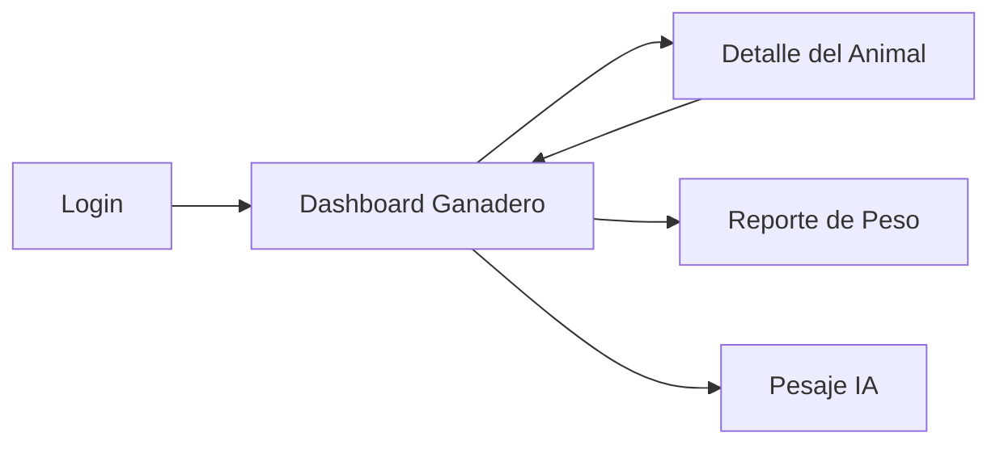

# Prototipo de Alta Fidelidad para BovWeight CR

Este documento describe las pantallas clave del sistema y su navegación, además de proponer un diseño visual moderno para la aplicación.

## 1. Pantalla de Login

- Fondo degradado cálido con formas suaves difuminadas.
- Tarjeta de acceso centrada con:
  - Icono de marca (vaca) grande.
  - Título del producto: `BovWeightCR`.
  - Campos tipo email y contraseña.
  - Botón principal `INICIAR SESIÓN` con color verde oscuro y radio amplio.
  - Ayuda de cuentas demo debajo.

### Elementos clave
- Título visible, tipografía moderna.
- Campos accesibles con iconos laterales.
- Feedback de error inmediato.

## 2. Dashboard de Ganadero

- Layout de dos columnas en escritorio:
  - Sidebar de navegación a la izquierda.
  - Contenido principal con estadísticas y lista de animales a la derecha.
- Cabecera translucida con usuario, rol y botón `logout`.
- Tarjetas de estadísticas con sombras suaves y colores distintivos.
- Panel de animales y panel de gráfico de peso.
- Botón flotante en móvil para registrar nuevo pesaje.

## 3. Detalle del Animal

- Encabezado con botón `Atrás` y título.
- Tarjeta hero con imagen o avatar del animal.
- Chips de raza y edad.
- Tarjeta de resumen de peso con color de éxito/advertencia.
- Gráfico de tendencia de peso.
- Botones de acciones: `Registrar Nuevo Peso` y `Ver Historial Completo`.

## 4. Navegación entre pantallas

- Login -> Dashboard Ganadero.
- Dashboard -> Detalle del Animal.
- Sidebar con accesos directos a métricas y pesajes IA.

## Wireframe en formato Mermaid

## Comentario visual

El prototipo usa dos bloques de contenido:
- `Sidebar` + `Main content` para mantener claridad.
- `Stat cards` y `panel cards` con bordes redondeados y fondo blanco.
- Uso de iconografía y espaciado generoso para que la interfaz sea táctil y legible.

## Conexión con los patrones aplicados

- `Repository` y `Adapter` en la capa de datos permiten que la interfaz consuma datos normalizados sin depender de la forma de la base de datos.
- `Factory` permite cambiar el origen de datos entre mock y Supabase sin modificar componentes.
- `Strategy` separa la lógica de estado de peso del UI.
